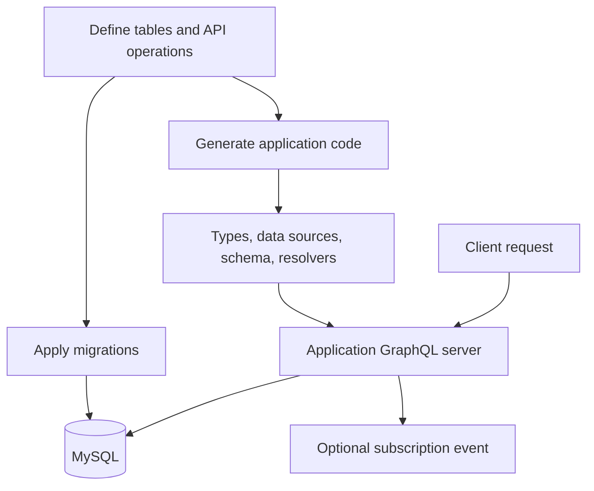

# Application structure and generated files

[README](../README.md) · [Configuration](configuration.md) · [Application workflow](application-workflow.md)

A Sasat application consists of migration definitions, generated code, and application-specific extensions. This guide uses the README's `migration.out: out` setting.

## File layout

```text
sasat-example/
├── package.json
├── tsconfig.json
├── sasat.yml                  # Connection settings and output paths
├── server.ts                  # GraphQL server and request context
├── migrations/
│   └── <timestamp>createUser.ts # Schema and exposed API definitions
└── out/
    ├── __generated__/         # Recreated during generation
    ├── dataSources/db/        # Application-specific database operations
    ├── schema.ts              # Schema and resolver extensions
    ├── context.ts             # Context type
    ├── middlewares.ts         # Resolver input processing and access checks
    ├── conditions.ts          # Custom query conditions
    ├── idEncoder.ts           # Hash ID encoders
    ├── pubsub.ts              # Event delivery
    └── baseDBDataSource.ts     # Shared data-source behavior
```

Generated code becomes part of your application. Put custom logic in extension files instead of editing `__generated__` directly.

## From definitions to requests



`migrate --generateFiles` applies database changes and generates code. `generate` rebuilds code from definitions without applying the normal migration SQL. Keep the database schema and generated application code in sync.

## Where to make changes

| Change | Location |
| --- | --- |
| Tables, columns, references, exposed CRUD | A new migration in migrations |
| Server port and context creation | server.ts |
| TypeScript context type | out/context.ts |
| Custom GraphQL fields and resolvers | out/schema.ts |
| Custom database queries and updates | The relevant class in out/dataSources/db |
| Processing before a resolver runs | out/middlewares.ts; register its exported name in the operation definition |
| Local or Redis event delivery | Environment variables or out/pubsub.ts |

`out/schema.ts` imports generated definitions and resolvers. Add custom definitions in the second argument of its `assignDeep(..., {})` calls. Data-source subclasses are also preserved when you regenerate.

## File ownership

| Files | Generation behavior |
| --- | --- |
| Everything under out/__generated__ | Recreated each time |
| out/dataSources/db, schema.ts, context.ts, pubsub.ts, baseDBDataSource.ts | Created only when missing; existing content is preserved |
| conditions.ts, idEncoder.ts, middlewares.ts | Existing content is read and missing declarations are added |

Files created only once are not automatically replaced during library upgrades. Review upgrade changes and incorporate relevant updates into your application.

## Application responsibilities

Sasat generates database operations and GraphQL types/resolvers. Your application decides how to authenticate requests, authorize access to rows, expose errors, and limit page sizes.

Selected relationships can be fetched through joins. Unloaded relationships and mutation refetches can still trigger additional queries, so measure the requests and data sizes your application actually uses.

Subscriptions use in-process delivery by default. Configure Redis when events must cross process boundaries. See [server, context, and subscription examples](runtime.md).

To work on the library implementation itself, see the source map in the [contributor guide](development.md).
